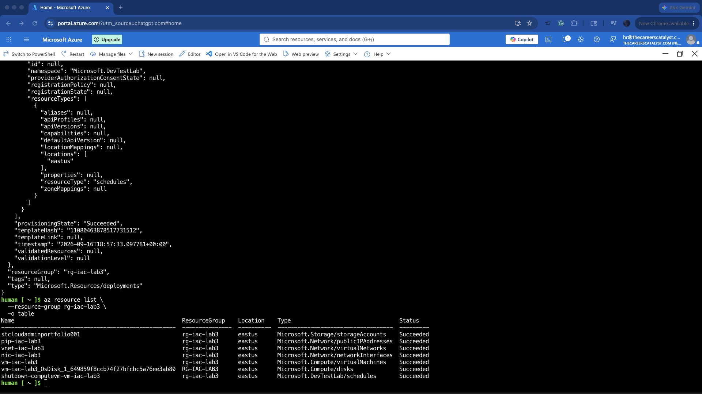
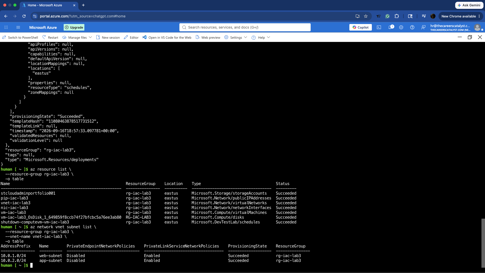
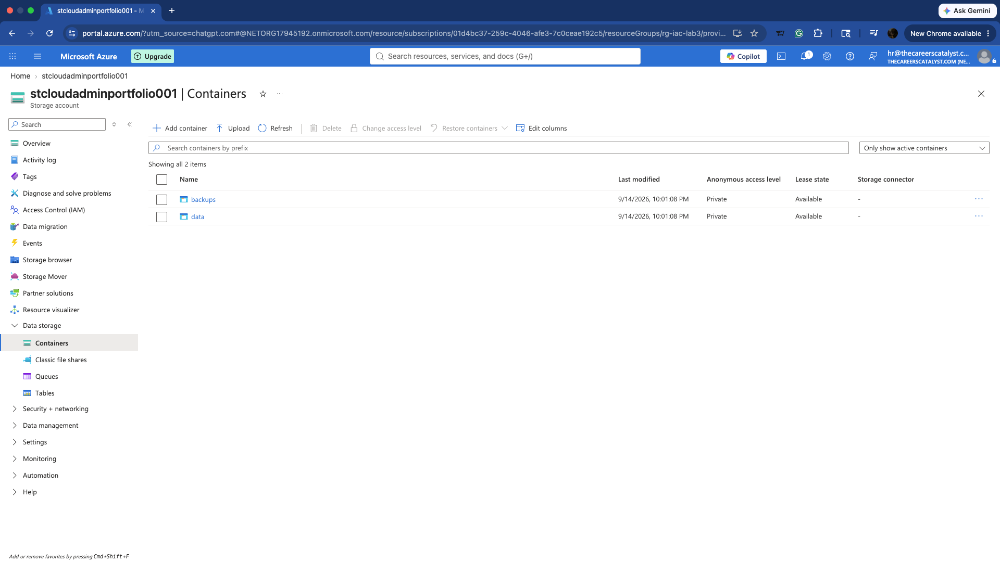
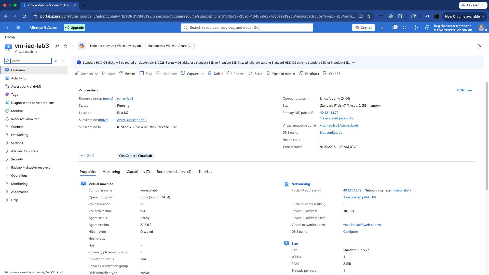
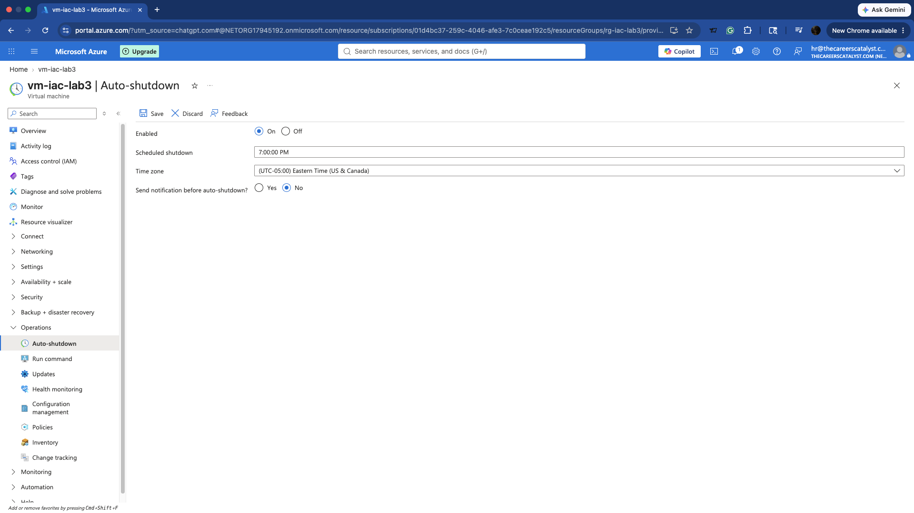

# Azure Infrastructure as Code (IaC) Deployment with Bicep

## Project Overview

This project demonstrates how I deployed Azure infrastructure using **Infrastructure as Code (IaC)** with **Azure Bicep** and the **Azure CLI**.

Instead of manually creating each Azure resource through the Azure Portal, I defined the infrastructure in Bicep templates, validated the templates, deployed the resources, and verified the completed environment.

This lab also gave me hands-on experience troubleshooting Azure Policy restrictions and deployment errors.

## Architecture

The environment includes:

- 1 Azure Resource Group
- 1 Virtual Network (`vnet-iac-lab3`)
- 2 Subnets
  - `web-subnet` — `10.0.1.0/24`
  - `app-subnet` — `10.0.2.0/24`
- 1 Storage Account (`stcloudadminportfolio001`)
- 2 private Blob Containers
  - `data`
  - `backups`
- 1 Ubuntu Linux Virtual Machine (`vm-iac-lab3`)
- 1 Network Interface
- 1 Standard Public IP
- Automated VM shutdown at **7:00 PM Eastern Time**
## Project Screenshots

### Deployed Azure Resources

The completed deployment includes the Storage Account, Public IP, Virtual Network, Network Interface, Linux VM, managed disk, and automated shutdown schedule.



### Virtual Network and Subnets

The virtual network contains separate web and application subnets with successful provisioning.



### Storage Account and Blob Containers

The Storage Account contains two private Blob containers, `data` and `backups`.



### Linux Virtual Machine

The Ubuntu VM was successfully deployed in East US and connected to the `web-subnet`.



### Automated VM Shutdown

Auto-shutdown is enabled for 7:00 PM Eastern Time to help control lab costs.


## Technologies Used

- Microsoft Azure
- Azure Bicep
- Azure CLI
- Azure Cloud Shell
- Visual Studio Code
- Git
- GitHub
- Ubuntu Linux

## Infrastructure as Code Files

### `main.bicep`

Defines the primary Azure infrastructure, including networking, storage, compute, resource tags, and VM configuration.

### `shutdown.bicep`

Defines the automated shutdown schedule for the virtual machine.

The shutdown schedule was also deployed separately during troubleshooting so that the existing VM infrastructure did not need to be recreated.
## Azure CLI Deployment

Create the resource group:

```bash
az group create \
  --name rg-iac-lab3 \
  --location eastus
```

Validate the Bicep template:

```bash
az deployment group validate \
  --resource-group rg-iac-lab3 \
  --template-file main.bicep
```

Deploy the infrastructure:

```bash
az deployment group create \
  --resource-group rg-iac-lab3 \
  --template-file main.bicep
```

Deploy the VM shutdown schedule separately if needed:

```bash
az deployment group create \
  --resource-group rg-iac-lab3 \
  --template-file shutdown.bicep
```

Verify deployed resources:

```bash
az resource list \
  --resource-group rg-iac-lab3 \
  --output table
```

## Azure Policy and Troubleshooting

During deployment, I encountered several real-world Azure configuration and policy issues.
### Policy Enforcement Evidence

Azure Policy initially blocked the deployment because required governance conditions were not satisfied.


After updating the configuration to comply with the required policies, the deployment completed successfully.


### VM Size Policy

The subscription restricted which VM SKUs could be deployed.

I identified the allowed SKU and updated the Bicep configuration to:

`standard_f1als_v7`

### Required Resource Tags

An Azure Policy required deployed resources to contain a `CostCenter` tag.

I updated the Bicep template to apply:

```bicep
tags: {
  CostCenter: 'CloudLab'
}
```

### Public IP Configuration

The original configuration attempted to use a Basic Public IP. The subscription did not permit this configuration.

I updated the Bicep template to use a **Standard Public IP**.

### VM Auto-Shutdown

The shutdown schedule required Azure's expected naming convention:

`shutdown-computevm-vm-iac-lab3`

After troubleshooting the schedule deployment, I separated the shutdown configuration into `shutdown.bicep` and successfully deployed it against the existing VM.

## Security Considerations

The VM administrator password is defined as a secure Bicep parameter rather than hard-coded into the template:

```bicep
@secure()
param adminPassword string
```

This prevents credentials from being stored directly in the GitHub repository.

The storage containers are also configured with private access.

## What I Learned

This project strengthened my understanding of:

- Infrastructure as Code
- Azure Bicep syntax and resource dependencies
- Azure Resource Manager deployments
- Azure networking and subnet configuration
- Azure Storage and Blob containers
- Linux VM deployment
- Azure Policy enforcement
- Resource tagging
- Secure Bicep parameters
- Azure CLI validation and deployment
- Troubleshooting failed cloud deployments
- Automated VM shutdown for cost management

## Interview Talking Point

In this project, I used Azure Bicep and the Azure CLI to deploy a complete Azure environment rather than manually provisioning resources through the portal.

The environment included networking, two subnets, Azure Storage with private Blob containers, an Ubuntu virtual machine, networking components, and an automated shutdown schedule.

One of the most valuable parts of the project was troubleshooting Azure Policy restrictions. My subscription required a specific VM SKU and a `CostCenter` resource tag, and it also prevented the Basic Public IP configuration I initially attempted to deploy.

I reviewed the deployment errors, modified the Bicep configuration to comply with the policies, validated the template again, and successfully deployed the environment.

This gave me practical experience not only with Infrastructure as Code, but also with diagnosing and resolving deployment issues in an Azure environment.
